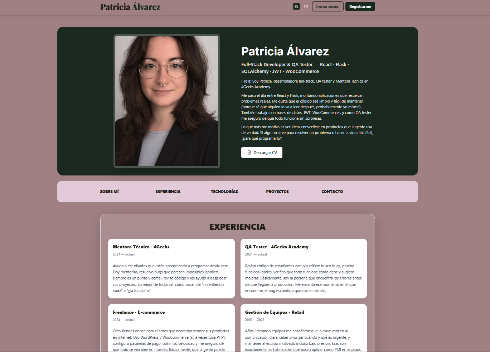
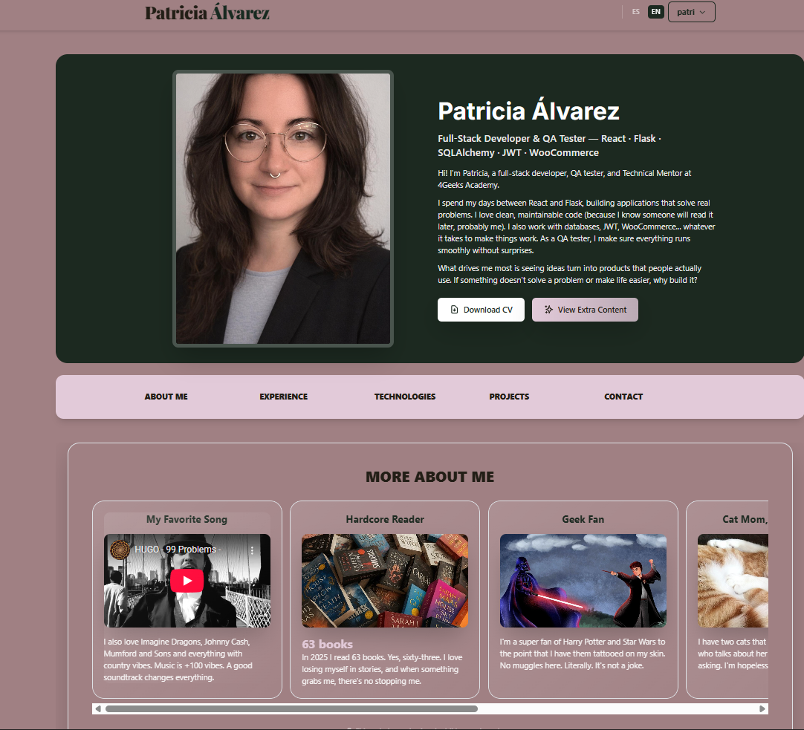
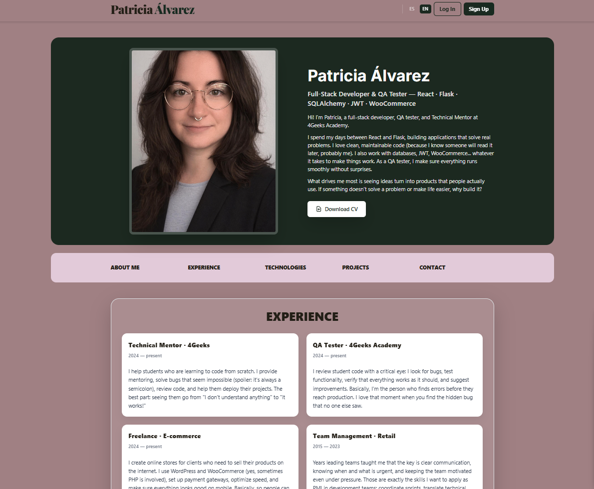
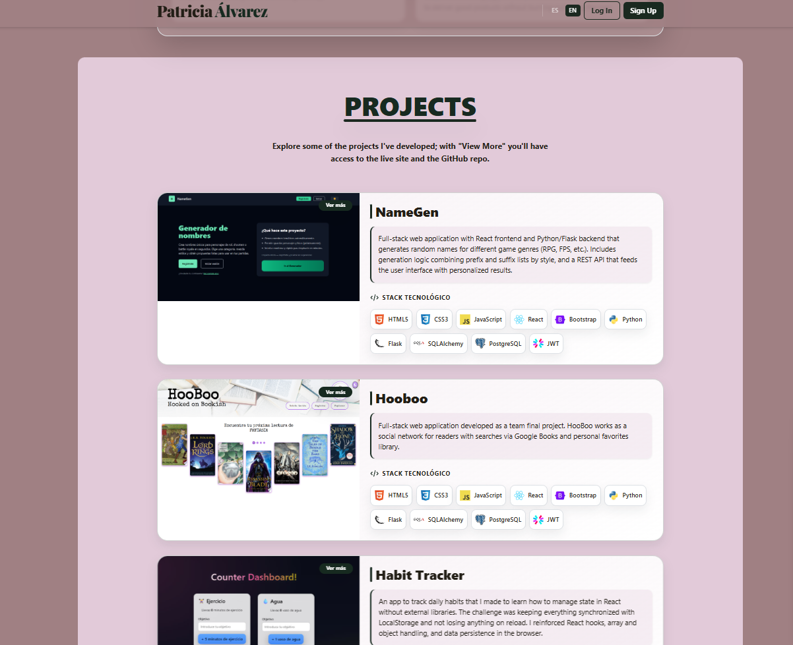
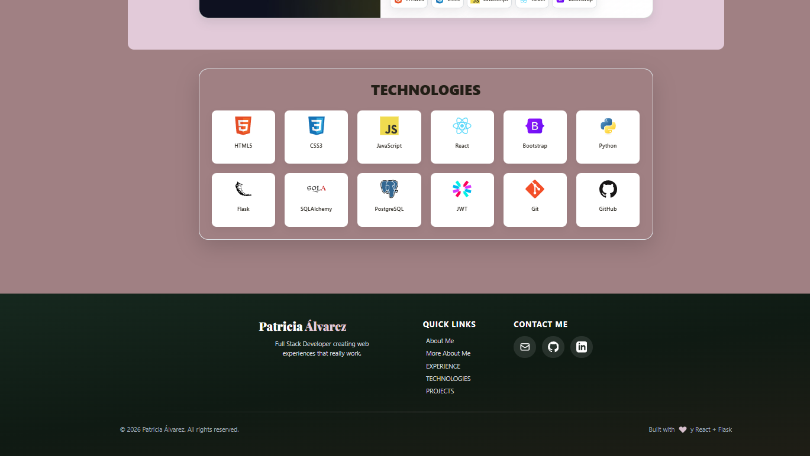

# Portfolio Patricia Álvarez (ES/EN)

Portfolio bilingüe con React + Vite (frontend) y Flask (backend) que muestra experiencia, proyectos, contacto y contenido exclusivo para usuarias registradas. Incluye conmutador de idioma (ES/EN), autenticación con JWT y persistencia de sesión, y modales con detalles de proyectos y CV.

## Capturas
- Home (ES): 
- Home (EN, logueada): 
- Home (EN, no logueada): 
- Proyectos: 
- Tecnologías & footer: 

## Características principales
- Bilingüe ES/EN con persistencia en `localStorage` y cambio en tiempo real.
- Autenticación (registro/login) con JWT y modal de bienvenida tras registro.
- Contenido extra solo para usuarias autenticadas (sección “Más sobre mí”).
- Sección de proyectos con descripciones largas/cortas traducidas y modales con links a live/repo.
- Modal de CV y modal de contacto con validaciones y feedback.
- Diseño responsive con Tailwind + Bootstrap, animaciones suaves y confetti en acciones clave.

## Tecnologías
- **Frontend:** React, Vite, TailwindCSS, Bootstrap, Context + useReducer, React Router (rutas), canvas-confetti.
- **Backend:** Python, Flask, SQLAlchemy, PostgreSQL, JWT, gunicorn (deploy).
- **Herramientas/DevOps:** npm, Vercel/Render, ESLint, PostCSS, New Relic opcional.

## Estructura rápida
- `src/components`: secciones y modales (Hero, Navbar, AuthModal, ContactModal, ProjectDetailModal, etc.).
- `src/data/translations.js`: diccionario ES/EN centralizado.
- `src/data/projectTranslations.js`: textos largos/cortos de proyectos por idioma.
- `src/store.js` + `src/hooks/useGlobalReducer.jsx`: estado global y acciones (auth, UI, idioma).
- `api/`: backend Flask (rutas públicas y auth, modelos, seed, extensiones, static).
- `src/img_readme/`: capturas usadas en este README.

## Requisitos previos
- Node 20+
- Python 3.10+
- PostgreSQL (para entorno local con backend).

## Configuración rápida (dev)
```bash
# Frontend
npm install
cp .env.example .env   # ajusta VITE_API_URL si es necesario
npm run dev             # Vite en http://localhost:3000 (o 3001 si está ocupado)

# Backend
cd api
python -m venv venv && source venv/bin/activate  # en Windows: venv\Scripts\activate
pip install -r requirements.txt
flask run --host=127.0.0.1 --port=5000
```

## Scripts útiles
- `npm run dev`: arranca frontend en modo desarrollo.
- `npm run build`: build de producción Vite.
- `npm run preview`: vista previa del build.
- Backend: `python app.py` o `flask run` (en carpeta `api`).

## Notas de uso
- El idioma se guarda en `localStorage` (`language`).
- El token JWT y usuario se guardan en `localStorage`; el modal de bienvenida usa `sessionStorage` para mostrarse una sola vez tras registro/login.
- El contenido extra y el modal de contacto requieren sesión iniciada.

## Licencia
MIT (ver `LICENSE`).
